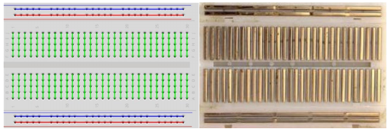

# My notes

## Project 1: Red LED

Ohm's law s I = V/R. The recommended current for the red LED is 10 to 20 mA. 3.3 V / 220 Ohm = **15 mA** which is right in the middle.

### Breadboard connections

The breadboard is connected as shown below:

### Compiling C programs

The command is `gcc Blink.c -o Blink -lwiringPi` (remember -lwiringPi option)